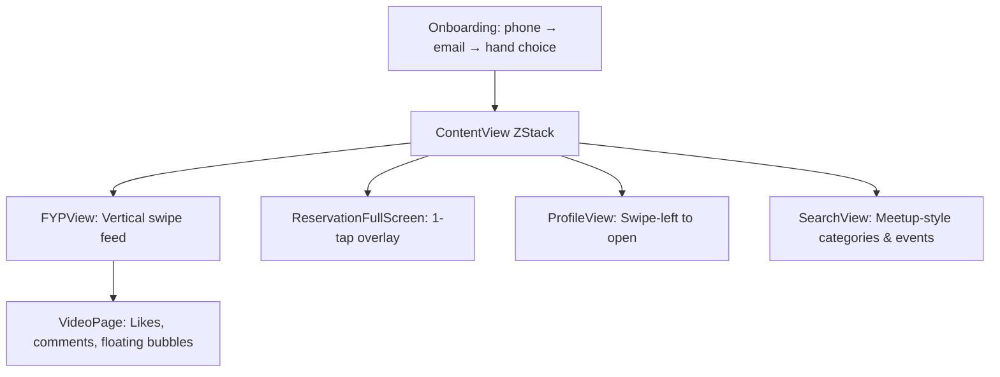

# SwiftSocial

A social discovery app for places, activities, and experiences — built with **SwiftUI (MVVM)**.

**SwiftSocial** helps users discover activities, see which friends are interested, book reservations instantly, and explore venues in a **TikTok-style immersive feed**.

This project was built for the **SwiftUI Social Discovery Track**, focusing on **product-market fit, addictiveness, and clean architecture**.

-----

## 📖 Table of Contents

  * [Overview](https://www.google.com/search?q=%23overview)
  * [Features](https://www.google.com/search?q=%23features)
  * [Architecture](https://www.google.com/search?q=%23architecture)
  * [Architecture Diagram](https://www.google.com/search?q=%23architecture-diagram)
  * [Installation](https://www.google.com/search?q=%23installation)
  * [Third-Party Inspiration](https://www.google.com/search?q=%23third-party-inspiration)
  * [License](https://www.google.com/search?q=%23license)

-----

## Overview

### Goal

Design an intuitive interface that:

  * Shows **venues and activities**
  * Displays which **friends/mutuals** are also interested
  * Allows **one-tap reservations**
  * Increases social connection and attendance
  * Uses **immersive micro-interactions** to boost retention

-----

### Demo

[Demo: https://youtu.be/qd5TlojL1l8](https://youtu.be/qd5TlojL1l8)

### Images

-----

## Features

### 🎥 Immersive Video Feed (TikTok-style)

The **For You Page** uses:

  * Full-screen videos
  * Vertical swiping
  * Caption + overlay UI
  * Gesture-based interactions (**tap, double-tap, swipe-left for profile**)

> TikTok’s interaction model is proven to maximize session time and dopamine-driven discovery.

-----

### 💸 Swipe FYP by Price Level

Top nav bar lets users filter content by:
`$ · $$·$$$ · $$$$`

**Why it works**

  * Users **budget-filter subconsciously**
  * Reduces cognitive overload
  * Mimics TikTok’s “topic filtering” which increases engagement
  * Leads to more relevant activity selection

-----

### ✋ Left-Handed / Right-Handed UI

**Onboarding** asks users their dominant hand.

This changes:

  * Sidebar icon placement
  * Floating friend bubble location
  * Gesture hit-zones

**Why this increases retention**

> TikTok & Instagram both optimize UI for thumb ergonomics.
> Shorter thumb-travel = more frequent interaction = **higher addiction loop**.

-----

### 💛 One-Tap Reservation System

Designed for **instant, frictionless conversion**.

  * ✔ Uses phone + email from onboarding
  * ✔ No card prompt unless needed
  * ✔ Smooth overlay confirmation
  * ✔ Success haptic feedback
  * ✔ Auto-returns to the video feed

**Why it’s smart**

> People abandon booking flows when asked for payment info upfront.
> **Delayed friction** dramatically boosts conversion.

-----

### 🫧 Floating “Friends Who Liked” Bubbles

Three floating circular avatars appear opposite the sidebar.

**Social Proof Works**

Instagram introduced this mechanic because:

  * Familiar faces = **trust**
  * Mutual engagement = stronger **FOMO**
  * Encourages exploring places together

> This feature fuels natural connection.

-----

### 💬 Smart Comments (Reviews + Social Comments)

A comment panel mixes:

  * **Google Review** snippets
  * **Yelp** insights
  * User comments

**Why this is powerful**

> Users always check reviews.
> Embedding reviews inside the **FYP** eliminates exit points, **increasing retention**.

-----

### 🔎 Meetup-Inspired Search View

Includes:

  * Category carousel (**All Events, New, Social, Hobbies, Sports**)
  * Large event cards
  * Real venue images
  * Distance, host, date/time, tags

**Why this works**

> Meetup’s scroll-and-skim design is proven for activity discovery and personal planning.

-----

### 🧭 Map Icon Navigation

A simple map icon in the top-left prepares for deeper location-based features.

-----

### 🎨 Polished Visual Design

  * **Dark theme** (`#0A0A2D`)
  * Smooth **haptics**
  * Floating layers
  * **MVVM** separation
  * Gesture-driven UI

-----

## Architecture

### Pattern

**MVVM** (Model–View–ViewModel)

### Directory Structure

```
/Models
    VideoItem.swift
    EventModel.swift
    HandPreference.swift

/ViewModels
    FYPViewModel.swift

/Views
    ContentView.swift
    FYP/
        FYPView.swift
        VideoPage.swift
        CommentsSimpleView.swift
        ProfileView.swift
    Reservation/
        ReservationFullScreen.swift
    Onboarding/
        OnboardingCoordinator.swift
        PhoneEntryView.swift
        EmailEntryView.swift
        HandPreferenceView.swift
    Search/
        SearchView.swift
```

Clear separation ensures:

  * **Scalable UI**
  * **Testable business logic**
  * Minimal side effects
  * Clean state management with `@StateObject` & `@Published`

-----

## Architecture Diagram



-----

## Installation

### 1️⃣ Clone the Repository

```bash
git clone https://github.com/yourusername/SwiftSocial.git
cd SwiftSocial
```

### 2️⃣ Open in Xcode

Open `SwiftSocial.xcodeproj`

### 3️⃣ Add Images

Place the following in your project root:

  * `img1.jpg`
  * `img2.jpg`
  * `img3.jpg`
  * `img4.jpg`
  * `img5.jpg`
  * `img6.jpg`
  * `person1.jpg`
  * `person2.jpg`
  * `person3.jpg`

### 4️⃣ Requirements

  * **Xcode 15+**
  * **iOS 17+**

-----

## Third-Party Inspiration

  * **TikTok** Interaction Research — Vertical swipe UX, engagement loops
  * **Instagram** Social Proof UI — Floating profile clusters
  * **Meetup** Discovery Flow — Category + event card hierarchy
  * **Apple HIG** — Motion, haptics, dark-mode color rules
  * **Google & Yelp** Review Data Structures — Used for comment fusion logic

-----

